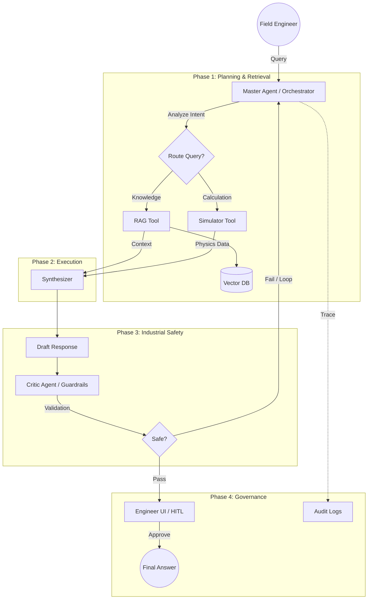

Here's the complete Markdown content ready for your `README.md` file:


# 🏗️ Industrial Agent Orchestrator

An enterprise-grade **Multi-Agent System** designed for the Energy & Oil sector. This project acts as a "Master Agent" orchestration layer that governs task-specific tools (Simulators, RAG) with strict industrial safety verification and human-in-the-loop (HITL) compliance.


## 🎯 Project Overview

In high-stakes industrial environments (e.g., Oil & Gas), generic LLMs cannot be trusted to make decisions autonomously. This system implements a **"Manager-Worker"** architecture where a high-reasoning "Master Agent" coordinates tasks, while a separate "Critic Agent" validates all outputs against safety constraints before they reach a human operator.

### Key Architectural Pillars
1.  **Agentic Orchestration:** Uses `LangGraph` to manage cyclical workflows (Plan -> Act -> Critique -> Loop).
2.  **Tool-Augmented Reasoning:** The LLM delegates math to a Python `Simulator` (Function Calling) rather than guessing.
3.  **Industrial Safety (The Critic):** Uses `Guardrails AI` (RAIL spec) to enforce schema validation and PII redaction.
4.  **Traceability:** Dual-path logging (Streaming & Batch) for full audit trails.

---

## 📐 System Architecture

This diagram represents the live logic flow implemented in `app/agents/orchestrator.py`.



---

## 🛠️ Tech Stack

*   **Core Framework:** FastAPI, Uvicorn
*   **Orchestration:** LangGraph (State Machine), LangChain
*   **Validation:** Guardrails AI (RAIL spec), Pydantic
*   **Vector Store:** ChromaDB (Prototype) / Interface ready for Pinecone
*   **Visualization:** Grandalf / Mermaid.js

---

## 📂 Project Structure

The project follows a modular architecture designed for **maintainability** and **enterprise scaling**.

```
/industrial-agent-orchestrator
├── /app
│   ├── main.py                  # FastAPI Entry Point & Graph Visualizer
│   ├── /agents
│   │   ├── orchestrator.py      # Master Agent (LangGraph State Machine)
│   │   └── safety.py            # Critic Logic (Loads RAIL file)
│   ├── /tools
│   │   ├── simulator.py         # Physics Engine (calc_pressure_flow)
│   │   └── retriever.py         # RAG Interface (Vector Store)
│   ├── /guardrails
│   │   └── safety_spec.rail     # XML Spec for PII & Safety Validation
│   ├── /infrastructure
│   │   ├── config.py            # Settings & Env Vars
│   │   └── /logging
│   │       ├── stream.py        # Real-time UI logs
│   │       └── batch.py         # Historical Audit logs
│   └── /schemas
│       └── safety.py            # Pydantic Models for Safety Report
├── /tests
│   └── test_safety.py           # Unit tests for Critic Agent
├── .env.example                 # Environment variables template
├── pyproject.toml
└── README.md
```

---

## 🏛️ Architectural Deep Dive

This system is designed using **Dependency Inversion** and **Interface Segregation** principles. This ensures that the "Brain" (Orchestration) is decoupled from the "Hands" (Tools) and the "Plumbing" (Infrastructure).

### The Interface Pattern (Scalability)
We use the **Dependency Inversion Principle** to decouple the Orchestrator from the Tools.

*   **Example - Vector Store:**
    *   For this **Prototype**, we implement **ChromaDB** for local agility.
    *   For **Production**, we can swap to **Pinecone** or **Azure AI Search** by changing a single line of initialization code. The Master Agent logic remains unchanged.

### Separation of Concerns
*   **Agents:** Handle reasoning, routing, and state management (LangGraph).
*   **Tools:** Handle execution (Physics calculations, Vector search).
*   **Infrastructure:** Handles logging, config, and external connections.

---

## 🚀 Getting Started

### Prerequisites
*   Python 3.11+
*   `uv` package manager (recommended)

### Installation

1.  **Clone the Repository**
    ```bash
    git clone https://github.com/your-username/industrial-agent-orchestrator.git
    cd industrial-agent-orchestrator
    ```

2.  **Install Dependencies**
    ```bash
    uv add fastapi uvicorn langchain langchain-openai langchain-community langgraph guardrails-ai pydantic-settings python-dotenv chromadb grandalf pytest
    ```

3.  **Configure Environment**
    Create a `.env` file in the root directory:
    ```bash
    OPENAI_API_KEY="sk-your-key-here"
    VECTOR_DB_PATH="./data/chroma_db"
    ```

### Running the Application

Start the FastAPI server:
```bash
uv run uvicorn main:app --reload
```

*   **API Docs:** `http://127.0.0.1:8000/docs`
*   **Architecture Visualizer:** `http://127.0.0.1:8000/graph`

---

## 📡 API Endpoints

| Method | Endpoint | Description |
| :--- | :--- | :--- |
| `POST` | `/query` | Main entry point. Submits an engineer's query to the Master Agent. |
| `GET` | `/graph` | Visualizes the live LangGraph architecture in the browser. |
| `GET` | `/` | Health check. |

### Example Scenario: The "High Pressure" Check

**1. The User Request:**
> "I need to increase the flow to 200 m³/h. Will the Viton seals on Pump A survive?"

**2. The Agent Logic:**
*   **Master Agent:** Detects keywords "flow", "Viton seals", "survive".
*   **Tool (Simulator):** Calculates temperature based on flow (returns `205°C`).
*   **Tool (RAG):** Retrieves "Pump A Manual" (returns `Viton limit: 200°C`).
*   **Synthesizer:** "Temperature will be 205°C. This exceeds the 200°C limit."

**3. The Critic:**
*   Validates the schema (`risk_level: HIGH`, `is_safe: false`).
*   **Passes** (The data is valid, even though the situation is unsafe).

**4. Final Response (JSON):**
```json
{
  "status": "SUCCESS",
  "response": "WARNING: Estimated temperature (205°C) exceeds Viton seal limit (200°C). Action: Do not increase flow.",
  "audit_id": "d4e5f6..."
}
```

---

## 🧪 Testing

Run the test suite to verify agent reliability and safety constraints:

```bash
uv run pytest
```

---

## 🔮 Roadmap

*   [ ] **Deployment:** Add Terraform scripts for Azure/AWS deployment.
*   [ ] **UI:** Streamlit interface for Human-in-the-Loop (HITL) approval.
*   [ ] **Optimization:** Implement Closed-Loop feedback from Observability Stack to Master Agent.

---

## 📄 License

This project is licensed under the MIT License.
```


